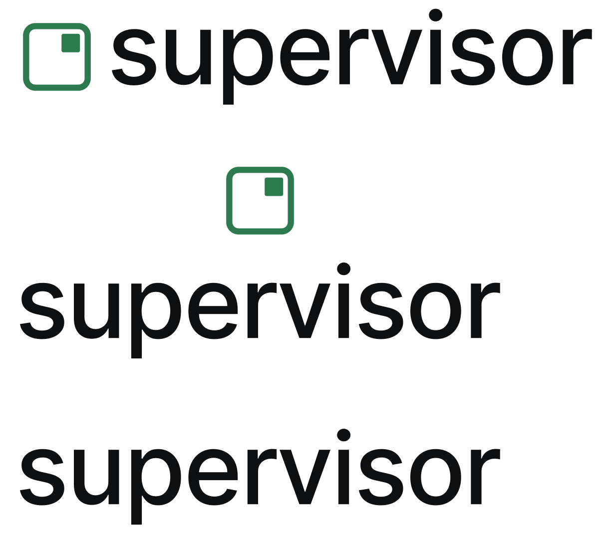

<div align="center">



<h3>Auto mode takes you out of the loop.<br/>Supervisor takes your place.</h3>

<p>A native macOS app that supervises your <a href="https://www.anthropic.com/claude-code">Claude Code</a> and Codex sessions, so you can step away without them stalling or going off the rails.</p>

<p>
<a href="https://github.com/maximizeGPT/supervisor/releases/latest/download/Supervisor.dmg"></a>
</p>

<p>
<a href="https://github.com/maximizeGPT/supervisor/actions/workflows/ci.yml"></a>
<a href="https://github.com/maximizeGPT/supervisor/releases"></a>
<a href="./LICENSE"></a>

</p>

<p>
<a href="https://supervisor-site-taupe.vercel.app">Website</a> &nbsp;·&nbsp; <a href="https://supervisor-site-taupe.vercel.app">60-second demo</a> &nbsp;·&nbsp; <a href="#use-it-as-a-skill-no-mac-needed">Use it as a skill</a>
</p>

</div>

---

Running a coding agent unattended is great until it stops to ask a question you are not there to answer, or does something you did not want. So you end up watching the terminal instead of doing your work.

Supervisor watches each session and acts in your place:

- **Answers the questions.** When Claude Code stops to ask, Supervisor reads the repo and answers in the session, in plain language. You stop being the bottleneck.
- **Keeps it moving.** It nudges an idle session forward toward its objective instead of letting it stall the moment you step away.
- **Stops the dangerous stuff.** When an action looks destructive, it flags it and tells you why, in one sentence you can actually read, and pauses the session when it can do so safely.

Everything runs on your Mac, on your own API key. Nothing leaves your machine except the same model calls you would make yourself.

**New in 0.3.0:** Codex sessions are supervised too. An opt-in second-opinion panel checks borderline calls across other models, context health monitoring warns when a long session starts degrading, and the portable Agent Skill below puts Supervisor inside your own agent, no download required.

## Install

### Download the app (recommended)

1. **[Download `Supervisor.dmg`](https://github.com/maximizeGPT/supervisor/releases/latest/download/Supervisor.dmg)**. It is signed and notarized by Apple, so it opens with a plain double-click, no Gatekeeper warning.
2. Drag `Supervisor.app` into Applications and launch it.
3. Onboarding walks you through the rest: paste an API key, grant Accessibility, allow Notifications.

Requires macOS 13 (Ventura) or later. Full first-run guide: **[INSTALL.md](./INSTALL.md)**.

### Use it as a skill (no Mac needed)

The portable subset of Supervisor ships as an [Agent Skill](https://agentskills.io) at [`skills/supervisor/`](./skills/supervisor/). It runs inside the agent you already use (Claude Code, Codex, Cursor, opencode, Amp, Gemini CLI, or anything that supports Agent Skills) on any OS with `python3`:

```bash
npx skills add maximizeGPT/supervisor
```

The skill watches your other sessions and flags real problems against Supervisor's triage rubric, blocks destructive shell commands with an optional hook, and generates a per-repo `principles.md` for unattended runs. It watches and flags; answering questions inside sessions, keeping them moving, and pause and stop are app territory.

### Build from source

```bash
git clone https://github.com/maximizeGPT/supervisor.git
cd supervisor
./Scripts/build-app.sh debug
open build/Supervisor.app
```

## How it works

Claude Code and Codex write a transcript of every session. Supervisor tails it as the agent works, runs a fast LLM triage against a small structured rubric on each turn, and acts only when something needs you:

- **Answer** a pending question by typing the response into the session.
- **Keep moving** by nudging an idle session forward toward its objective.
- **Flag, pause, or stop** a destructive command, with a plain-language reason.

Four intervention types, ordered by escalation. `notify` is the floor: every stronger intervention checks that it can act safely first, and degrades to a notification when it cannot.

| Type   | What it does                                                             | Degrades to notify when                                                                                                  |
|--------|--------------------------------------------------------------------------|---------------------------------------------------------------------------------------------------------------------------|
| notify | macOS banner notification plus a hover flag. Always available.           | Never. This is the fallback for everything else.                                                                           |
| inject | Types an answer or corrective text into the session's composer.          | The targeter is not confident it found the right conversation, the text does not land as a turn, or a human is actively typing. |
| pause  | Sends `SIGSTOP` to the agent CLI process so it freezes in place.         | The resolved target is the shared desktop app (never signaled), or the session cannot be resolved to a single process.     |
| kill   | Sends `SIGTERM` to the agent CLI process so it shuts down cleanly.       | Same guards as pause.                                                                                                       |

> [!NOTE]
> Interventions are honest and best-effort by design: you always get told; you do not always get an automatic save. Triage also reads the transcript after a tool call is recorded, so a very fast command can finish before its flag arrives. Every degrade is logged with a reason, and the hover panel shows what actually happened.

Three things make it trustworthy:

- **Local and private.** Everything runs on your Mac. A redaction layer strips secrets (API keys, tokens, credentials) before any model call, and refuses to send a request without it. Fail-closed by design.
- **Bring your own key.** No server, no subscription, no per-seat pricing. Use the key you already have: Anthropic, DeepSeek, Moonshot Kimi, MiniMax, Qwen, or OpenRouter. Your usage is billed to you, at cost.
- **Honest health.** A companion menu-bar process reports green, amber, or red, so you always know whether Supervisor is actually watching.

The architecture at a glance: [docs/architecture.svg](./docs/architecture.svg).

## Pricing

Free and open source. The only thing you pay for is the model usage you would have paid for anyway, billed to you directly and never to us. At heavy use (~6 hours of Claude Code a day) triage runs about $80/month on Anthropic and a few dollars a month on DeepSeek. The in-app cost view shows your real spend, and you can set a hard daily cap that pauses triage when hit.

## Contributing

```bash
swift build      # compile
swift test       # run the test suite
```

Issues are welcome. A useful one includes the last ~50 lines of `~/Library/Logs/Supervisor/supervisor.log`, your macOS version (`sw_vers -productVersion`), and what the agent was doing when the surprise happened. The trace log is local-only and is not redacted, so scrub anything sensitive before pasting.

## License

[MIT](./LICENSE) &copy; Mohammed Wasif
