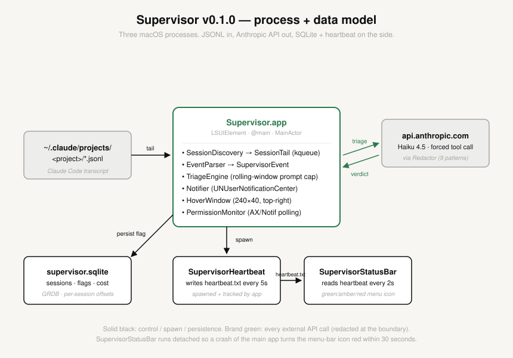

<div align="center">

<!-- DEMO_GIF_PLACEHOLDER: ~10s recording showing launch, rm-rf trigger, banner + hover red; target docs/demo.gif <5 MB, swap this comment for:  -->


> **Redirects Claude Code in real time.**

[](https://github.com/maximizeGPT/supervisor/actions/workflows/ci.yml)
[](https://github.com/maximizeGPT/supervisor/releases)
[](./LICENSE)
[](https://www.apple.com/macos/)

</div>

Supervisor is a native macOS safety harness for [Claude Code](https://www.anthropic.com/claude-code) sessions. It tails the session's JSONL transcript as the assistant generates tool calls, runs a two-stage LLM triage against a structured rubric, and steps in when the session needs it: it watches, answers questions, keeps sessions moving, flags danger, and pauses or stops a session when it can do so safely. The harness runs entirely on your Mac. It uses your own API key from any of six providers (Anthropic, DeepSeek, Moonshot Kimi, MiniMax, Qwen, OpenRouter). No data leaves your machine except the triage calls sent to the provider you chose.

## What it does

Claude Code writes a JSONL transcript of every session to `~/.claude/projects/<project>/<sessionId>.jsonl`. Each turn appends one record at a time: the user message, the assistant message, every `tool_use` block, every `tool_result`. Supervisor watches that file via `kqueue`, parses each new event into a typed `SupervisorEvent`, and feeds the recent window into a triage prompt.

The triage runs a fast model (Claude Haiku 4.5 on Anthropic; the equivalent tier on the other providers) against a structured rubric. The rubric covers a small set of well-defined failure modes: destructive shell actions against non-temp paths, edits that would clobber unrelated work, calls into Cowork's sealed repos, fixture-replay loops, prompt-injection-shaped tool outputs. The model returns a structured `record_triage` call with severity, category, evidence UUIDs, and free-text reasoning. When severity is medium or above, Supervisor persists a flag, posts a macOS notification, and routes the case into one of four intervention types. The hover window in the top-right corner of your screen pulses to show the current session's most recent flag at a glance.

The whole observation and triage path is built to keep cost predictable. Every API call goes through a redaction layer first (Anthropic keys, GitHub tokens, AWS pairs, JWTs, URL credentials, shell exports), and the per-flag cost is bounded by a rolling-window prompt cap. Token use is logged to a local SQLite store so you can see your spend per session, per day, per category. The trace log at `~/Library/Logs/Supervisor/supervisor.log` records every state transition for diagnosability.

## Interventions

Four types, ordered by escalation. `notify` is the floor: every other intervention checks that it can act safely first, and degrades to a notification when it cannot.

| Type   | What it does                                                             | Degrades to notify when                                                                                                                                                |
|--------|--------------------------------------------------------------------------|-------------------------------------------------------------------------------------------------------------------------------------------------------------------------|
| notify | macOS banner notification plus a hover flag. Always available.           | Never. This is the fallback for everything else.                                                                                                                          |
| inject | Types an answer or corrective text into the session's composer.          | The desktop targeter is not confident it found the right conversation, the paste does not land as a turn, or a human is actively typing (the dispatch queues instead). |
| pause  | Sends `SIGSTOP` to the Claude Code CLI process so it freezes in place.   | The resolved target is the shared Claude desktop app (never signaled), or the session cannot be resolved to a single process.                                             |
| kill   | Sends `SIGTERM` to the Claude Code CLI process so it shuts down cleanly. | Same guards as pause.                                                                                                                                                     |

Every degrade is logged with a discriminating reason, and the hover panel shows what actually happened. Supervisor never silently claims an intervention it did not deliver. [DESIGN.md](./DESIGN.md) documents the full router, the targeting pipeline, and the degrade paths.

## Known limitations

These are real and shipped as-is.

**Post-write timing limit.** Triage reads the transcript after Claude Code records a tool call. For fast tools that complete before triage returns, the flag arrives after the action has already executed; you'll see the notification, but the action will already be done. Supervisor does not claim to stop a command before it lands. Direct integration with Claude Code's tool-use hooks is the eventual fix for this gap.

**Interventions are best-effort.** As the table above shows, inject, pause, and kill each verify they can act safely before acting, and fall back to a notification when they cannot. The reliable floor is: you always get told; you don't always get an automatic save.

**Main-app liveness detection.** Main-app death is detected via a 30-second heartbeat freshness window. If the main app dies via SIGTERM (rather than a clean Quit from the menu bar), detection can lag up to that window.

**Bring your own API key.** Supervisor has no server component and no usage-based revenue model; every triage call goes straight from your Mac to the provider you configured. On Anthropic at heavy use (~6 hours of Claude Code per day, mixed exploration and build), triage runs ~$80/month; cheaper providers (e.g. DeepSeek) run a few dollars a month at the same usage. Cost grows linearly with session activity. The in-app cost view shows your real spend, and you can set a hard daily cap that pauses triage when hit.

## Installation

**Download.** The released `Supervisor.dmg` is signed with an Apple Developer ID and notarized by Apple, so it opens like any normal Mac app: no Gatekeeper warning, no right-click workaround. Open the dmg, drag `Supervisor.app` into Applications, double-click it. [INSTALL.md](./INSTALL.md) has the full walkthrough.

**No Mac, or don't want another app?** The portable subset of Supervisor ships as an Agent Skill at [`skills/supervisor/`](./skills/supervisor/). It runs inside the agent you already use (Claude Code, Codex, Cursor, opencode, Amp, Gemini CLI, or anything that supports [Agent Skills](https://agentskills.io)) and needs only `python3`:

```bash
npx skills add maximizeGPT/supervisor
```

Or copy `skills/supervisor/` into `~/.claude/skills/` (or your agent's skills directory). The skill watches your other sessions and flags problems against Supervisor's triage rubric, blocks destructive shell commands via a hook, and generates a per-repo `principles.md` for unattended runs. It watches and flags; it does not answer questions inside sessions, keep them moving, or pause them. That is the app.

**Build from source.** Supervisor builds on macOS 13+. The build script asks for nothing beyond what Xcode Command Line Tools provide (the first `swift build` will auto-prompt to install CLT if you've never opened Xcode).

```bash
git clone https://github.com/maximizeGPT/supervisor.git
cd supervisor
./Scripts/build-app.sh debug
```

That produces two bundles under `build/`:

- `Supervisor.app`, the main app. Menu-bar-only (no Dock icon). It embeds and auto-spawns `SupervisorStatusBar`, a small companion binary that owns the menu-bar health icon out-of-process.
- `SupervisorHeartbeat.app`, a companion process that proves the main app is alive (also embedded inside `Supervisor.app`).

Source builds are signed with a local certificate rather than a Developer ID, so macOS may invalidate the Accessibility grant after OS updates; Supervisor catches that and prompts a re-grant.

**First launch.** The onboarding window walks you through five steps:

1. **API key.** Pick a provider (Anthropic, DeepSeek, Moonshot Kimi, MiniMax, Qwen, or OpenRouter) and paste your key. Supervisor validates it against the provider's API with a one-token test call before storing it in Keychain; invalid, rate-limited, and network-error states surface inline with retry.
2. **Accessibility permission.** macOS routes you to System Settings > Privacy & Security > Accessibility. Toggle Supervisor on. This is what lets Supervisor type an answer into a session; skipping it still leaves watching, notifications, and pause/stop working.
3. **Screen Recording permission.** Used only to target the right conversation in the Claude desktop app. Terminal-only users can skip it.
4. **Notification permission.** macOS asks once. Allow shows full banners; deny still lets flags appear in Notification Center.
5. **Customization.** Shows where the editable rules files live and where session reports export (`~/Downloads/Supervisor Reports/`).

**Running.** Launch the main app:

```bash
open ./build/Supervisor.app
```

If everything's working you'll see:

- The hover window in the top-right corner of your active screen: 240x40, a green dot meaning "watching, no flag".
- A green checkmark in your menu bar (right side): Supervisor's brand mark, template-tinted to match your menu bar's foreground.
- The first time Claude Code does something the rubric flags, a macOS banner notification slides in and the hover dot turns amber or red depending on severity.

**Resetting.** To wipe the API keys and start over:

```bash
for p in anthropic deepseek moonshot minimax qwenhf openrouter; do
  security delete-generic-password -s "live.supervisor.api.$p" 2>/dev/null
done
rm -rf ~/Library/Application\ Support/Supervisor
rm -rf ~/Library/Logs/Supervisor
```

## Architecture



The brief version. [DESIGN.md](./DESIGN.md) has the full design doc; every decision is traceable.

- **Companion architecture.** The main `Supervisor.app` does observation, triage, intervention, and UI. It auto-spawns the embedded `SupervisorStatusBar` companion, which owns the menu-bar health icon out-of-process, while `SupervisorHeartbeat` writes a heartbeat file every 5 seconds. The status item reports green/amber/red from heartbeat freshness, so a crashed main app still turns the menu-bar icon red within 30 seconds. The user always has an honest health signal in their menu bar.
- **`kqueue` JSONL tailing.** Per-session `DispatchSourceFileSystemObject` watching each active session log, with byte-offset checkpoints in SQLite so a restart resumes from exactly where it left off. Verified via Phase 0 spikes against active real-world sessions.
- **Two-stage LLM triage.** A forced `record_triage` tool call returns a structured verdict: severity, category, evidence UUIDs, free-text reasoning. A fast model triages every event; a stronger-model escalation for borderline medium-severity decisions exists in the codebase (`BorderlineEscalator`) but ships gated off by default.
- **Structured rubric.** A small fixed rubric covers the core failure modes; the onboarding customization step points at the editable rules files that tune how Supervisor acts.
- **Redaction in front of every API call.** `Redactor.swift` strips nine pattern families before any string leaves the Mac (Anthropic keys, GitHub tokens in three formats, AWS access-key + secret pairs, JWTs, URLs with embedded credentials, shell-export lines). The LLM client refuses to send a request without a redactor wired in; fail-closed by construction.

## Development

```bash
swift build               # full compile of all targets
swift test                # ~1,076 tests across the package (live-API tests are env-gated and skip without a key)
./Scripts/build-app.sh    # rebuild + sign the .app bundles
```

The trace log at `~/Library/Logs/Supervisor/supervisor.log` is append-only and rolls at 10 MB to `supervisor.log.1` (one historical segment kept). Every state transition (onboarding, AX grants, key validation, triage start/end, flag persistence, notifier outcome, heartbeat health) emits a single line with a timestamp and a tag. It's the first thing to look at when something's off.

**Filing an issue.** Useful issues include:

- The last ~50 lines of `~/Library/Logs/Supervisor/supervisor.log` covering the surprising moment.
- Your macOS version (`sw_vers -productVersion`).
- What you were doing, and what Claude Code action led into the surprise.
- Whether the surprise was a false positive (Supervisor flagged something safe), false negative (Supervisor missed something destructive), or behavioral (the app misbehaved in a way unrelated to flags).

If the issue involves an API call going wrong, scrub the trace snippet for anything sensitive before pasting; the redactor handles the API path but the trace log is local-only and isn't redacted by default.

## License

MIT. See [LICENSE](./LICENSE).
