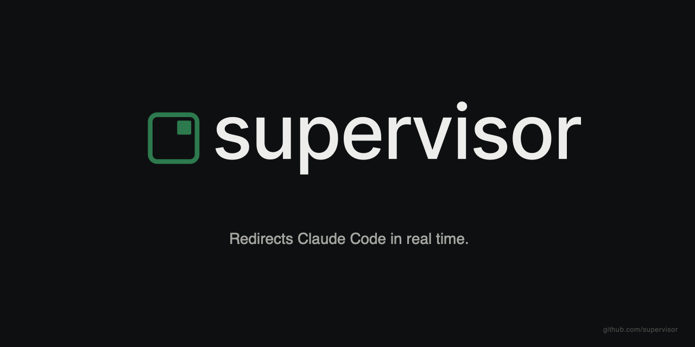

<div align="center">



> **Redirects Claude Code in real time.**

</div>

Supervisor is a native macOS safety harness for [Claude Code](https://www.anthropic.com/claude-code) sessions. It tails the session's JSONL transcript as the assistant generates tool calls, runs a two-stage LLM triage against a structured rubric, and surfaces a flag — a notification, and (from v0.1.2) an intervention — when the next action looks destructive or unsafe. The harness runs entirely on your Mac. It uses your own Anthropic API key. No data leaves your machine except the same `messages` call you'd send Claude yourself.

## What it does

Claude Code writes a JSONL transcript of every session to `~/.claude/projects/<project>/<sessionId>.jsonl`. Each turn appends one record at a time: the user message, the assistant message, every `tool_use` block, every `tool_result`. Supervisor watches that file via `kqueue`, parses each new event into a typed `SupervisorEvent`, and feeds the recent window into a triage prompt.

The triage runs Claude Haiku 4.5 against a structured rubric. The rubric covers a small set of well-defined failure modes — destructive shell actions against non-temp paths, edits that would clobber unrelated work, calls into Cowork's sealed repos, fixture-replay loops, prompt-injection-shaped tool outputs. Haiku returns a structured `record_triage` call: severity, category, evidence UUIDs, free-text reasoning. When severity ≥ medium, Supervisor persists a flag, posts a macOS notification, and (v0.1.2+) routes the case into one of four intervention types. The hover window in the top-right corner of your screen pulses to show the current session's most recent flag at a glance.

The whole observation+triage path is built to keep cost predictable — every Claude API call goes through a redaction layer first (Anthropic keys, GitHub tokens, AWS pairs, JWTs, URL credentials, shell exports), and Haiku's per-flag cost is bounded by a rolling-window prompt cap. Token use is logged to a local SQLite store so you can see your spend per session, per day, per category. The trace log at `~/Library/Logs/Supervisor/supervisor.log` records every state transition for diagnosability.

## Known limitations

These are real and shipped as-is. The roadmap section pairs each with the version that closes the gap.

**Post-write timing limit.** Supervisor catches the next destructive action before it lands. For fast tools that complete before triage returns, the flag arrives after the action has already executed; you'll see the notification but the action will already be done. v0.2's hook channel will close this gap by integrating with Claude Code's tool-use hooks directly.

**Main-app liveness detection.** Main-app death is detected via a 30-second heartbeat freshness window. If the main app dies via SIGTERM (rather than a clean Quit from the menu bar), the heartbeat child orphans and detection fails until v0.1.1's mach-port liveness check lands.

**Bring your own Anthropic API key.** Supervisor has no server component and no usage-based revenue model — every triage call goes straight from your Mac to `api.anthropic.com` with your key. At Mohammed's actual usage (~6 hours of Claude Code per day, mixed exploration and build), Haiku triage runs ~$80/month. Cost grows linearly with session activity; the in-app cost view shows your real spend. You can also set a hard daily cap that pauses triage when hit.

**Unsigned for v0.1 MVP.** No Apple Developer ID, no notarization. macOS Gatekeeper will warn on first launch — right-click → Open through the "unidentified developer" warning. v0.1.x adds Apple Developer ID signing once the harness has dogfood miles. Until then, macOS may also invalidate the Accessibility grant after OS updates; Supervisor catches that and prompts a re-grant.

## Roadmap

**Intervention surface.** Four types, ordered by escalation:

| Type    | Version | What it does                                                       |
|---------|---------|--------------------------------------------------------------------|
| notify  | v0.1.0  | macOS banner notification when the rubric flags an action. **Shipping.** |
| inject  | v0.1.2  | Send corrective text into the terminal where Claude Code is running. |
| pause   | v0.1.2  | Send `SIGSTOP` to the Claude Code process so it freezes in place.    |
| kill    | v0.1.2  | Send `SIGTERM` to the Claude Code process so it shuts down cleanly.  |

**Other near-term work:**

- **v0.1.1** — mach-port liveness check that catches main-app SIGTERM-orphan within ~1s instead of relying on a 30s heartbeat window. Sonnet 4.6 escalation for ambiguous Haiku decisions.
- **v0.1.2** — the three non-notify interventions above.
- **v0.1.3** — Apple Developer ID signing + notarization.
- **v0.1.4** — user-editable rubric (`~/Library/Application Support/Supervisor/rubric.yaml`).
- **v0.1.7+** — expanded hover panel with click-through flag history, in-app cost dashboard, per-session intervention preferences.
- **v0.2** — direct integration with Claude Code's tool-use hook channel, closing the post-write timing gap above.

## Installation

Supervisor builds from source on macOS 13+. The build script asks for nothing beyond what Xcode Command Line Tools provide (the first `swift build` will auto-prompt to install CLT if you've never opened Xcode).

```bash
git clone https://github.com/<owner>/supervisor.git
cd supervisor
./Scripts/build-app.sh debug
```

That produces three bundles under `build/`:

- `Supervisor.app` — the main app. Menu-bar-only (no Dock icon).
- `SupervisorStatusBar.app` — the menu-bar health indicator.
- `SupervisorHeartbeat.app` — companion process that proves the main app is alive.

**First launch.** Right-click `Supervisor.app` → Open → confirm the Gatekeeper warning (unsigned MVP). The onboarding window walks you through three steps:

1. **Anthropic API key.** Paste your key from [console.anthropic.com](https://console.anthropic.com). Supervisor validates it against the API with a one-token test call before storing it in Keychain — invalid / rate-limited / network-error states surface inline with retry.
2. **Accessibility permission.** macOS routes you to System Settings → Privacy & Security → Accessibility. Toggle Supervisor on. Skip is fine — v0.1.0's only intervention is `notify`, which doesn't use Accessibility. The popover re-surfaces when Inject ships in v0.1.2.
3. **Notification permission.** macOS asks once. Allow shows full banners; deny still lets flags appear in Notification Center.

**Running.** Start the status-bar companion alongside:

```bash
open ./build/Supervisor.app
open ./build/SupervisorStatusBar.app
```

If everything's working you'll see:

- The hover window in the top-right corner of your active screen — 240×40, a green dot meaning "watching, no flag".
- A green checkmark in your menu bar (right side) — Supervisor's brand mark, template-tinted to match your menu bar's foreground.
- The first time Claude Code does something the rubric flags, a macOS banner notification slides in and the hover dot turns amber or red depending on severity.

**Resetting.** To wipe the API key and start over:

```bash
security delete-generic-password -s live.supervisor.api
rm -rf ~/Library/Application\ Support/Supervisor
rm -rf ~/Library/Logs/Supervisor
```

## Architecture

The brief version. [DESIGN.md](./DESIGN.md) has the full 1,184-line design doc — every decision is traceable.

- **Two-process companion architecture.** The main `Supervisor.app` does observation, triage, intervention, UI. `SupervisorHeartbeat` writes a heartbeat file every 5 seconds. `SupervisorStatusBar` reads that file every 2 seconds and reports green/amber/red based on freshness. A crash of the main app turns the menu-bar icon red within 30 seconds — the user always has an honest health signal in their menu bar.
- **`kqueue` JSONL tailing.** Per-session `DispatchSourceFileSystemObject` watching each active session log, with byte-offset checkpoints in SQLite so a restart resumes from exactly where it left off. Verified via Phase 0 spikes against active real-world sessions.
- **Two-stage LLM triage** (Haiku 4.5 today; Sonnet 4.6 escalation lands v0.1.1). Forced `record_triage` tool call returns a structured verdict — severity, category, evidence UUIDs, free-text reasoning. The two-stage pattern is borrowed verbatim from the eval harness that scores Claude Code transcripts at Anthropic — Haiku triages every event, Sonnet only re-runs ambiguous medium-severity decisions where the cheap model's confidence is low.
- **Structured rubric.** A small fixed YAML rubric in v0.1.0; user-editable in v0.1.4. Every category has a deterministic schema (the example: `destructive_action_pending` matching `rm -rf`/`Trash`/`git reset --hard` against non-temp paths).
- **Redaction in front of every API call.** `Redactor.swift` strips nine pattern families before any string leaves the Mac (Anthropic keys, GitHub tokens in three formats, AWS access-key + secret pairs, JWTs, URLs with embedded credentials, shell-export lines). The Anthropic client refuses to send a request without a redactor wired in — fail-closed by construction.

## Development

```bash
swift build               # full compile of all 6 targets
swift test                # 130 tests across SupervisorCore
./Scripts/build-app.sh    # rebuild + sign all three .app bundles
```

The trace log at `~/Library/Logs/Supervisor/supervisor.log` is append-only and rolling (1 MiB segments). Every state transition — onboarding, AX grants, key validation, triage start/end, flag persistence, notifier outcome, heartbeat health — emits a single line with a timestamp and a tag. It's the first thing to look at when something's off.

**Filing an issue.** Useful issues include:

- The last ~50 lines of `~/Library/Logs/Supervisor/supervisor.log` covering the surprising moment.
- Your macOS version (`sw_vers -productVersion`).
- What you were doing — what Claude Code action led into the surprise.
- Whether the surprise was a false positive (Supervisor flagged something safe), false negative (Supervisor missed something destructive), or behavioral (the app misbehaved in a way unrelated to flags).

If the issue involves an API call going wrong, scrub the trace snippet for anything sensitive before pasting — the redactor handles the API path but the trace log is local-only and isn't redacted by default.

## License

MIT. See [LICENSE](./LICENSE).
